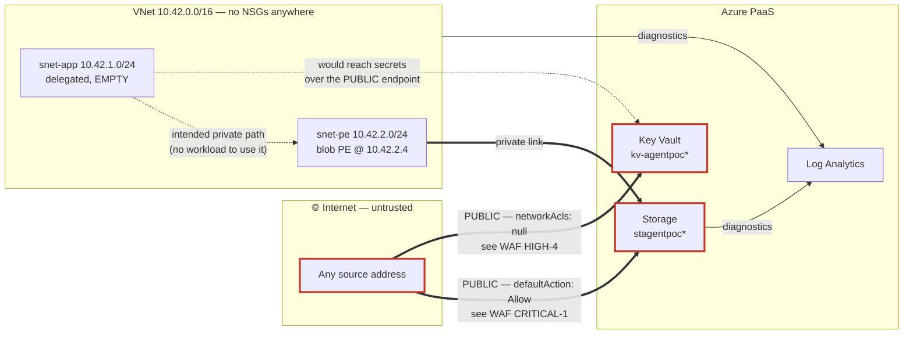

# Architecture — `rg-agentpoc-8e9e55d7`

**As-built, reverse-engineered.** Written 2026-09-18 from a live export.

> **This document describes. It does not judge.** Severity, risk and remediation
> live in [waf-review.md](waf-review.md). Where a design choice is dangerous,
> this document says what it is and points there.
>
> **Purpose and intent below are inferred from artefacts, not documented.** No
> design record exists for this estate. Every inference names the evidence it
> rests on so a reader can disagree with it. The machine-generated inventory is
> in [generated-inventory.md](generated-inventory.md) and regenerates from the
> export; this document is written and does not.

---

## 1. Inferred purpose

> A single-region, privately-networked web application. Compute in a delegated
> subnet with regional VNet integration, reaching blob storage over a private
> endpoint with private DNS resolution, holding secrets in Key Vault,
> authenticating as a workload identity rather than with keys, and logging to a
> central workspace.

Nothing states this. It is inferred from seven artefacts, each of which would be
pointless under any other reading:

| Inference | Evidence |
|---|---|
| Compute was planned | `snet-app` carries a `Microsoft.Web/serverFarms` delegation — a delegation exists only to host something |
| Private data access intended | blob private endpoint, `privatelink.blob.core.windows.net` zone, VNet link, and an A record resolving to `10.42.2.4` |
| Secrets externalised | Key Vault provisioned with `enableRbacAuthorization: true` and an empty `accessPolicies` array |
| Keyless identity intended | a user-assigned managed identity exists at all |
| Central observability | Log Analytics workspace, with diagnostics wired from the VNet and the storage account |
| Two-tier segmentation | a deliberate split between an application subnet and a private-endpoint subnet |
| Disposable | resource group tagged `purpose=agent-pipeline-poc`, `disposable=true` |

---

## 2. Context

One resource group in one subscription, one region (`uksouth`). No peering, no
gateway, no connection to any other network. Nothing outside the resource group
depends on anything inside it.

The estate is **self-contained and has no consumers**. That is the single most
important scoping fact: every change here is local.

---

## 3. Logical view

Three tiers were intended. Two exist.

| Tier | Intended | Built |
|---|---|---|
| **Application** | App Service, VNet-integrated into `snet-app`, running as the managed identity | **absent** — subnet and delegation reserved, nothing in them |
| **Data** | Blob storage reached privately; secrets from Key Vault | storage built with a private endpoint; Key Vault built with **no** private endpoint |
| **Platform** | Central Log Analytics, workload identity, diagnostics | built, partially wired |

---

## 4. Network design

Address space `10.42.0.0/16`, two subnets, no NSGs anywhere.

| Subnet | Prefix | Usable | Role |
|---|---|---|---|
| `snet-app` | `10.42.1.0/24` | 251 | delegated to `Microsoft.Web/serverFarms`; empty |
| `snet-pe` | `10.42.2.0/24` | 251 | private endpoints; holds the blob PE at `10.42.2.4` |

`privateEndpointNetworkPolicies` is `Disabled` on both subnets — the platform
default, and the reason an NSG attached to `snet-pe` would silently fail to
filter private-endpoint traffic.

### Data flow — and where it actually goes

The intended private path exists. So does an unintended public one, and the
diagram is drawn to show both, because a topology view that omits the public
route describes a system that was never built.

Read the heavy lines. The private endpoint adds a private route to storage; it
removes nothing. Both services answer the internet.

---

## 5. Identity design

| Principal | Holds | Reaches |
|---|---|---|
| `id-agentpoc-*` (user-assigned MI) | **Contributor** at resource-group scope | every resource's control plane |
| — | **no data-plane role** on storage or the vault | — |
| A human user | Owner at subscription scope | everything |

The vault has RBAC authorisation enabled, empty access policies, and **no role
assignment granting any principal data-plane access**. As built, nothing can
read a secret from it.

---

## 6. Intended versus realised

The design is incomplete, and it contradicts itself in three places. This is the
section to read if you are inheriting the estate.

### 6.1 The compute never landed

A full `/24` and a `Microsoft.Web/serverFarms` delegation are reserved for an
App Service that does not exist. Reading the estate alone, you cannot tell
whether this is work-in-progress or abandoned scope.

*(Recorded so the estate is self-explanatory: the App Service plan was blocked
by zero quota on a free-trial subscription, at every tier including F1, and was
replaced by a standalone managed identity.)*

### 6.2 The private-networking intent is half-applied

Storage got a private endpoint, a private DNS zone, a VNet link and an A record.
Key Vault got none of it — there is no `privatelink.vaultcore.azure.net` zone in
the resource group.

So the application would have reached its **blobs privately and its secrets over
the public internet**. The network design disagrees with itself, and the
half that was skipped is the half holding the credentials.

### 6.3 The keyless-identity intent is defeated by its own permissions

This is the sharpest contradiction in the estate.

A managed identity exists, which only makes sense as an intent to avoid shared
secrets. But it holds **Contributor at resource-group scope and no data-plane
role**. Contributor includes `Microsoft.Storage/storageAccounts/listkeys/action`,
and `allowSharedKeyAccess` is unset — which Microsoft documents as *permitting*
Shared Key.

The identity's only actual path to blob data is to fetch the account key. Access
is then authorised as the account rather than as the identity: invisible to RBAC
scoping, indistinguishable in logs from any other key holder, and outside
Conditional Access.

**Every ingredient of a keyless design is present. The wiring between them was
never finished.** See WAF HIGH-3.

---

## 7. Constraints

Decisions already fixed. Changing any of these means rebuilding the resource,
not editing it.

| Resource | Property | Value | Why it is fixed |
|---|---|---|---|
| Key Vault | `softDeleteRetentionInDays` | `7` | Settable only at creation. The default is 90; 7 was chosen. |
| Storage | `requireInfrastructureEncryption` | unset | Create-time only. Cannot be enabled later. |
| Storage | replication SKU | `Standard_LRS` | LRS→ZRS conversion is constrained; some paths need a new account. |
| `snet-app` | `addressPrefix` | `10.42.1.0/24` | Resizable only while empty — so, before compute lands. |
| `snet-pe` | `addressPrefix` | `10.42.2.0/24` | As above; currently occupied by the private endpoint. |

The subnet prefixes are the live deadline: `snet-app` is empty **now**, and
stops being resizable the moment an App Service plan is placed in it.

---

## 8. Scaling ceilings

No compute exists, so there is nothing to scale and no stated throughput target.
Recorded for whoever adds the application:

1. **Key Vault throttling is per vault, not per caller.** Every App Service
   instance shares one request budget. Cache secrets at startup; do not fetch
   per request.
2. **Subnet address pool.** Regional VNet integration consumes one address per
   instance plus a reserve during scale and platform upgrades. At `/24` this is
   comfortable and will not bind first.
3. **Storage account request rate limits**, once a real workload exists.

---

## 9. Open questions

A reader should establish these before changing anything:

1. Is the missing App Service abandoned scope, or work in progress?
2. Was Key Vault's lack of private networking a deliberate trade-off or an
   oversight? The answer decides whether §6.2 is a defect or a decision.
3. Was the 7-day vault retention chosen, or accepted from a template? It cannot
   be changed now.
4. Are the two subnets sized for a known workload, or are those numbers
   arbitrary? `snet-app` can still be resized; that window closes on first use.
5. Is this estate genuinely disposable, as its tag claims? It has no owner tag
   and no expiry date, which is how sandboxes become permanent.
