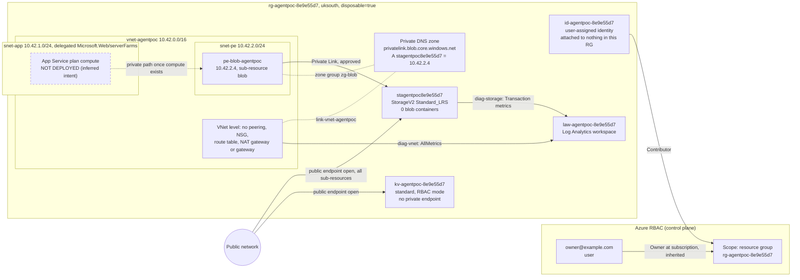

This is the as-built design document for `rg-agentpoc-8e9e55d7`, reverse-engineered from all twelve export files. It describes the design and is not a security review.

# `rg-agentpoc-8e9e55d7`: as-built high-level design (reverse-engineered)

| | |
|---|---|
| **Basis** | Twelve JSON exports of one resource group (section 11). I used no live tenant access, IaC or prior documentation. |
| **Written** | 2026-09-19. The export carries no timestamp of its own. The latest time inside it is 2026-09-18 19:54:55 UTC. |
| **Where** | Subscription `00000000-0000-0000-0000-000000000000`, tenant `11111111-1111-1111-1111-111111111111`, region `uksouth`. |
| **How to read** | `[nn]` is the export file number. Unmarked statements come straight from the export. **Inference** marks my interpretation and what it rests on. **Learn** marks platform behaviour I checked against Microsoft Learn on 2026-09-19 (links in section 10). |

## 1. Summary

- **Age and tags.** The resource group is one day old and tagged `purpose=agent-pipeline-poc`, `disposable=true` [02].
- **What is there.**
  - A VNet with an integration subnet and a private-endpoint subnet.
  - A storage account with a blob private endpoint and private DNS.
  - A Key Vault.
  - A user-assigned managed identity.
  - A Log Analytics workspace.
- **No workload.** This is the plumbing that normally surrounds an App Service-hosted workload, but no workload exists.
- **Build.** Everything was created in one ten-minute sequence on 2026-09-18 [01]. The only creator the export names is owner@example.com [07][08].

Treat it as a scaffold. Most elements are present but carry no load yet.

| Element | What exists | State today |
|---|---|---|
| App hosting | `snet-app` delegated to `Microsoft.Web/serverFarms` [03] | No plan or app in the inventory [01]; the subnet is empty [03] |
| Private access to blob | Private endpoint, DNS zone, zone group, VNet link [05][10] | Provisioned and approved, but no client can use it; the public endpoint is also open [06] |
| Private access to Key Vault | Nothing [07] | Public endpoint only |
| Workload identity | `id-agentpoc-8e9e55d7` [08] | Attached to nothing in this RG [01]; holds Contributor on the RG and no data-plane role [08][12] |
| Data | Storage account, Key Vault | Zero blob containers [11]; vault contents not exported; no principal holds a vault data role [08][12] |
| Logging | Workspace plus two diagnostic settings [09] | Platform metrics only; no resource logs from anything |
| Network controls | None | No NSG, route table, NAT gateway, peering or gateway [03][04] |

## 2. What it appears to be for

**Stated.** The RG tags above are the only statement of purpose [02]. Every name carries the token `agentpoc`. The resources themselves are untagged [01].

**Inference: the shape is an App Service workload scaffold.** This rests on four things:
- `snet-app` is delegated to `Microsoft.Web/serverFarms` [03].
  - Learn: this delegation serves regional VNet integration for App Service apps, function apps and Logic Apps.
  - Learn: it requires a Basic-or-higher or Elastic Premium plan.
- A separate `snet-pe` holds a blob private endpoint with its private DNS zone [03][05][10].
- A Key Vault, a managed identity and a workspace complete the usual set.
- The 10.42.1.0 / 10.42.2.0 split into an app subnet and a PE subnet is the conventional layout for that pattern.

**Inference: the workload has not been deployed.** This rests on:
- There is no `Microsoft.Web/*` resource in the inventory [01].
- All nine resources show `identity: null` [01].
- `snet-app` lists no `ipConfigurations` and no `serviceAssociationLinks` [03]. Learn describes the latter as "references to services injecting into this subnet".
- The storage account has zero containers [11].

**The export cannot tell me what "agent pipeline" means.** Two readings fit:
- **(a)** The intended workload is itself an agent pipeline, to be hosted on App Service or Functions.
- **(b)** The RG is a disposable target for automation agents to inspect, import, document or change, and the realistic mix of resource types is the point.

The Contributor-on-RG grant to the identity [08] is what a deployer needs, not what a workload needs. That leans towards (b), or towards the identity being a pipeline's deployment identity. It is weak evidence, so ask the owner.

## 3. Architecture

| Resource | Type | Created 2026-09-18 (UTC) | Notes |
|---|---|---|---|
| `vnet-agentpoc` | Virtual network | 19:35:08 | 10.42.0.0/16, two subnets |
| `law-agentpoc-8e9e55d7` | Log Analytics workspace | 19:35:59 | Properties not exported |
| `stagentpoc8e9e55d7` | Storage account | 19:36:33 | StorageV2, Standard_LRS, Hot |
| `pe-blob-agentpoc` | Private endpoint | 19:38:33 | Targets storage `blob`; connection `conn-blob` auto-approved |
| `pe-blob-agentpoc.nic.c3843bdd-…` | NIC | 19:38:44 | Managed by the endpoint; 10.42.2.4 |
| `privatelink.blob.core.windows.net` | Private DNS zone (`global`) | 19:39:06 | 2 record sets, 1 VNet link |
| `…/link-vnet-agentpoc` | VNet link | 19:39:39 | Auto-registration off |
| `kv-agentpoc-8e9e55d7` | Key Vault | 19:40:25 | standard SKU, RBAC mode |
| `id-agentpoc-8e9e55d7` | User-assigned identity | 19:44:54 | Contributor on the RG |

Child and extension resources are:
- Zone group `zg-blob` [10].
- Diagnostic settings `diag-vnet` and `diag-storage` [09].
- One RG-scope role assignment [08].

## 4. Network

| Range | Name | Notes [03] |
|---|---|---|
| 10.42.0.0/16 | `vnet-agentpoc` | No peerings, DDoS plan off |
| 10.42.1.0/24 | `snet-app` | Delegated `Microsoft.Web/serverFarms`; `defaultOutboundAccess: false`; nothing attached |
| 10.42.2.0/24 | `snet-pe` | No delegation; holds the endpoint NIC; `defaultOutboundAccess` not present |
| 10.42.0.0/24 and 10.42.3.0 upward | unallocated | |

- **`purpose` on `snet-pe`.** The value `PrivateEndpoints` is a platform-derived, read-only property (Learn). It is not something the builder set.
- **What is absent.** There are no NSGs [04] and none referenced by either subnet [03]. There are also no route tables, NAT gateway, gateway subnet, Bastion, firewall or public IPs [01][03].
- **Island VNet.** **Inference**: nothing sits inside the VNet and nothing connects to it, so no client anywhere can currently use the private path.
- **Private Link.**
  - `pe-blob-agentpoc` connects to the storage account's `blob` sub-resource only [05].
  - Its IP is dynamically allocated, because the endpoint has no static `ipConfigurations` [05].
  - Zone group `zg-blob` maintains the A record `stagentpoc8e9e55d7` → `10.42.2.4`, TTL 10 [10].
  - The zone sits in this RG.
- **Inference on the zone's record count.** The zone's two record sets [05] are the automatic SOA plus that A record.
- **Inference on the link target.** The link targets `vnet-agentpoc`. I take this from its name and from it being the only VNet, because the export omits the link's properties.
- **DNS.** No custom DNS servers appear on the VNet [03].
  - **Inference**: it uses Azure-provided DNS, which is what makes the linked zone effective.
  - The export omits unset properties, so this is suggestive rather than conclusive.
- **Resolution.** Learn: inside the VNet the blob hostname resolves to 10.42.2.4. Outside it resolves to the public endpoint.
- **Egress.** There is no explicit outbound method.
  - Learn: `defaultOutboundAccess: false` makes a subnet "private" for VMs.
  - Learn: private subnets "aren't applicable to delegated or managed subnets", so the flag is inert on `snet-app` as built.

## 5. Data and secrets

**Storage account `stagentpoc8e9e55d7`** [06][11]

| Aspect | As built |
|---|---|
| Network | `publicNetworkAccess: Enabled`; default action `Allow`; no IP, VNet or resource rules; `bypass: None`. Learn: a private endpoint does not by itself block the public endpoint, so both paths are live. `bypass` has no effect while the default action is Allow. |
| Anonymous access | `allowBlobPublicAccess: true`. Learn: the API's default interpretation is false, so this was set explicitly. It only permits container-level anonymous access, and with no containers nothing is anonymously readable today. |
| Authorisation | `allowSharedKeyAccess: null`, so account keys and SAS are usable. Keys date from account creation. |
| Transport and encryption | HTTPS only; minimum TLS 1.2; Microsoft-managed keys; no customer-managed key; no infrastructure encryption |
| Data protection | Blob soft delete off; container soft delete, versioning, change feed and point-in-time restore not configured |
| Off or unset | Hierarchical namespace, SFTP, NFSv3, local users, static website, CORS; cross-tenant replication false |
| Contents | 0 blob containers. The export does not enumerate file shares, queues or tables. |

**Key Vault `kv-agentpoc-8e9e55d7`** [07]

| Aspect | As built |
|---|---|
| Permission model | Azure RBAC, no access policies. Learn: RBAC is the default for new vaults from API 2026-02-01, so this may be a default and not a choice. |
| Network | Public access Enabled, `networkAcls: null`, no private endpoint connections |
| Recovery | Soft delete on, 7 days (Learn: 7 is the minimum and 90 the default, so this was chosen). Purge protection is not enabled. **Inference**: both fit `disposable=true`, giving a quick purge and quick name reuse. |
| Other | standard SKU; deployment, disk-encryption and template-deployment flags all false; created by owner@example.com and unmodified since |
| Contents | Not exported (data plane) |

## 6. Identity and access

[08] lists two assignments and [12] (resource-scoped) is empty.

| Principal | Role | Scope | Created (UTC) | By |
|---|---|---|---|---|
| owner@example.com (user `44444444-…`) | Owner | Subscription | 2026-09-18 19:26:08 | blank |
| `id-agentpoc-8e9e55d7` (principal `22222222-…`, client `33333333-…`) | Contributor | Resource group | 2026-09-18 19:45:01 | the user above |

Effective access as built:

| | Control plane | Blob via Entra ID | Blob via account key | Key Vault data |
|---|---|---|---|---|
| User (Owner) | Full, including role assignment | None | Yes | None until a vault data role is assigned; can self-assign |
| Identity (Contributor) | Full within the RG, no role assignment | None | Yes | None; cannot self-assign |

- **Storage.** Learn: Owner and Contributor "don't provide access to data in a storage account via Microsoft Entra ID", but they do include `listkeys`.
- **Key Vault.**
  - Neither role carries data actions.
  - Learn: changing a vault's permission model needs `roleAssignments/write`, which Contributor lacks.

## 7. Observability

| Source | Setting | Reaches the workspace | Present but off, or absent |
|---|---|---|---|
| `vnet-agentpoc` | `diag-vnet` | AllMetrics | `VMProtectionAlerts` logs disabled |
| Storage account (account level) | `diag-storage` | Transaction metrics | Capacity metrics disabled; this level has no log categories |
| Blob service | none [11] | none | Read, write and delete logs |
| Key Vault, workspace, endpoint, NIC, DNS zone | none | none | |
| VNet link, managed identity | unsupported | none | |

- The workspace receives platform metrics only.
- Nothing in it records data-plane access to the storage account or the vault.
- The RG has no alert rules, action groups or Application Insights [01].
- Workspace SKU, retention and daily cap were not exported.

## 8. Provenance, lifecycle, naming

**Timeline**
- The build ran in strict dependency order, 19:35:08 to 19:45:01 UTC, at 30 to 60 second spacing [01].
- The identity received its role 7 seconds after it was created [08].
- The zone group, both diagnostic settings and the RG itself carry no timestamps.

**Inference: a sequential script of imperative commands, such as Azure CLI, run under the user's own sign-in.** This rests on:
- The strictly serial order.
- The 7-second gap, which is too fast for portal clicks.
- Key Vault `createdByType: User`.

A single declarative deployment would have created the independent resources in parallel. Deployment history would settle the question, but it was not exported.

**Inference: the subscription was new or newly handed over.** The Owner assignment predates the first resource by nine minutes and has a blank `createdBy` [08].

**`changedTime` is weak evidence.**
- Four resources show it almost exactly 10 minutes after creation, and two show about 10.5 minutes.
- I read those as platform housekeeping.
- Two other resources stand out:
  - **VNet** (+2 min 35 s): this is 50 seconds before the endpoint was created, which fits a subnet add or update.
  - **Storage account** (+18 min 11 s): this fits a post-create update, and the account does carry explicitly set values.

**Resilience as built**
- Single region.
- LRS storage.
- No blob recovery features.
- 7-day vault recovery.
- No locks or backups evidenced.
- All of this is consistent with the `disposable` tag.

**Naming**
- The pattern is `<type>-agentpoc[-8e9e55d7]`.
- The suffix appears on the RG, workspace, storage account, vault and identity, but not on network resources.
- I do not know where the suffix comes from. It matches neither the subscription ID nor the tenant ID.

## 9. Before you change it

1. **Closing the storage public endpoint leaves one data path.**
   - That path is blob, through 10.42.2.4, from inside `vnet-agentpoc`.
   - Learn: private-endpoint traffic is always allowed, and each sub-resource needs its own endpoint.
   - Queue, table, file, dfs and web would become unreachable.
   - Blob from anywhere outside the VNet would also be unreachable. That includes the operator's workstation and any pipeline runner, because the VNet has no peering, gateway or jump host.
   - `bypass: None` then starts to matter, because there is no trusted-service exception.
   - ARM operations are unaffected.
   - If the compute turns out to be Azure Functions using this account as host storage, it also needs queue, table and file (general knowledge, not re-verified).

2. **Do not hand-edit the DNS record.**
   - Zone group `zg-blob` owns it [10].
   - The endpoint IP is dynamic, so recreating the endpoint can move it off 10.42.2.4.
   - Learn, known constraint: creating the endpoint put `privatelink` into the account's public CNAME chain. Any other VNet that links its own `privatelink.blob.core.windows.net` zone must reach this account through a private endpoint too, or resolution fails.
   - That matters if the estate ever joins centrally managed private DNS, because this zone is local to the RG.

3. **An NSG or route table on `snet-pe` will not apply to endpoint traffic.**
   - It stays that way until `privateEndpointNetworkPolicies` is changed from `Disabled`. Learn: `Disabled` is the default, and it is set on both subnets [03].
   - On `snet-app`, Learn: only outbound rules and UDRs affect integrated apps, and only for traffic routed into the VNet.

4. **`snet-app` takes only App Service plan compute, in `uksouth`.**
   - Learn: integration "requires an unused subnet". It uses one address per plan instance, temporarily doubled during scale up or down.
   - Learn: "subnet size can't be changed after assignment".
   - The /24 gives 251 usable addresses. That is the fixed ceiling on plan scale-out, and it is shared if several plans join the subnet.
   - Today, while the subnet is empty, is the cheap moment to resize it.
   - No scaling configuration exists yet. When one arrives, the other hard limit behind it is the storage account's default request rate. Learn: 40,000 requests per second in UK South.

5. **Identity.**
   - Token-based blob access with the managed identity will return 403 until a Storage Blob Data role is assigned.
   - Account keys are the only working data path today.
   - Disabling shared-key access removes that path for everyone.
   - Contributor lets whatever runs as the identity reconfigure or delete everything in the RG and read the storage keys.
   - The export does not show federated credentials or assignments outside this RG. Check both before deleting or re-scoping the identity.

6. **Key Vault.**
   - Nobody can read or write secrets, keys or certificates until a vault data role is assigned [08][12]. That includes the subscription Owner, who can assign one to themselves.
   - The 7-day retention is fixed for the vault's life (Learn).
   - Purge protection is irreversible once enabled (Learn).
   - Learn notes that services using vault keys for encryption, Storage included, require purge protection. Using this vault for customer-managed keys therefore costs its quick-teardown behaviour.
   - Closing the vault's public endpoint needs a new private endpoint, a `privatelink.vaultcore.azure.net` zone and a link. None of these exist.
   - Closing it has the same operator lock-out as item 1.

7. **Teardown and rebuild.**
   - Deleting the RG soft-deletes the vault.
   - Its name stays reserved for 7 days unless it is purged. Purge is possible because purge protection is off (Learn).
   - A rebuild that reuses `8e9e55d7` must purge first.
   - Learn: soft-deleting a vault deletes its role assignments, and recovery does not restore them.
   - `disposable=true` exists only on the RG. The resources are untagged, and Azure does not inherit RG tags, so tooling keyed on resource tags will not see it.
   - Once an app is integrated, Learn: the VNet cannot be deleted until the app is disconnected. Orphaned service association links can block subnet changes.

8. **Growth.**
   - The vault name is 20 of a 24-character maximum (Learn). Adding `-prod` makes it 25.
   - The storage name is 18 of 24.
   - 10.42.0.0/16 is unpeered, so check for address overlap before peering.

9. **No source of truth is evidenced.** Decide what it is (IaC or a script) before hand-changing the estate a second time.

## 10. Not in the export, and unverified claims

**Not in the export.** Confirm these against the tenant:
- The intended workload, and whether it is coming.
- The identity's federated credentials and any assignments outside this RG.
- Deployment history.
- Locks, Policy assignments, Defender plans and budgets.
- Workspace SKU, retention and daily cap.
- Vault contents.
- File shares, queues and tables.
- The VNet link's target and the VNet's DNS servers.
- Role assignments above subscription scope, and PIM-eligible assignments.
- Other resource groups in the subscription.

**Learn pages used (2026-09-19):**
- [default outbound access](https://learn.microsoft.com/en-us/azure/virtual-network/ip-services/default-outbound-access)
- [private endpoint network policies](https://learn.microsoft.com/en-us/azure/private-link/disable-private-endpoint-network-policy)
- [Subnets – Get](https://learn.microsoft.com/en-us/rest/api/virtualnetwork/subnets/get)
- [Storage private endpoints](https://learn.microsoft.com/en-us/azure/storage/common/storage-private-endpoints)
- [Storage firewall](https://learn.microsoft.com/en-us/azure/storage/common/storage-network-security)
- [anonymous read access](https://learn.microsoft.com/en-us/azure/storage/blobs/anonymous-read-access-prevent)
- [Storage Accounts – Create](https://learn.microsoft.com/en-us/rest/api/storagerp/storage-accounts/create)
- [storage account overview](https://learn.microsoft.com/en-us/azure/storage/common/storage-account-overview)
- [Key Vault soft-delete](https://learn.microsoft.com/en-us/azure/key-vault/general/soft-delete-overview)
- [Key Vault recovery](https://learn.microsoft.com/en-us/azure/key-vault/general/key-vault-recovery)
- [Key Vault RBAC guide](https://learn.microsoft.com/en-us/azure/key-vault/general/rbac-guide)
- [Key Vault object naming](https://learn.microsoft.com/en-us/azure/key-vault/general/about-keys-secrets-certificates)
- [App Service VNet integration](https://learn.microsoft.com/en-us/azure/app-service/overview-vnet-integration)

**Not verified, so treat as my knowledge or reasoning:**
- The default of storage `bypass`. I believe it is `AzureServices`, which would make `None` explicit.
- `allowSharedKeyAccess: null` meaning "allowed".
- Owner and Contributor carrying no data actions.
- Azure Functions host-storage needs.
- RG tags not being inherited by resources.
- The `changedTime` housekeeping reading.
- The meaning of a blank `createdBy`.
- `privateEndpointVNetPolicies: Disabled` on the VNet [03], which I did not interpret.

## 11. Sources

All files are in `C:\Users\jdk\import-duty-work\fable-arch\`:
- `01-resources.json`
- `02-resource-group.json`
- `03-vnets.json`
- `04-nsgs.json` (empty)
- `05-private-networking.json`
- `06-storage.json`
- `07-keyvaults.json`
- `08-identity-rbac.json`
- `09-diagnostic-settings.json`
- `10-pe-dns-zone-groups.json`
- `11-storage-detail.json`
- `12-role-assignments-resource-scope.json` (empty)

**Process notes**
- I read only the twelve files in scope. I did not query the live tenant.
- Learn lookups carried no estate identifiers.
- One Learn fetch (resource naming rules) was auto-saved by the tool to a path outside the scoped directory. I did not open it, and I verified the two naming limits from narrower pages instead.
- Bringing this estate under Terraform belongs to `terraform-import`. Authoring modules or pipelines belongs to `devops-infrastructure-expert`.
